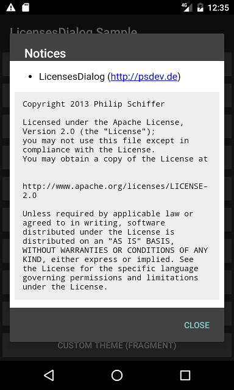

LicensesDialog [](https://ci.psdev.de/job/PSDevLicensesDialog/) [](https://sonar.psdev.de/dashboard?id=de.psdev.licensesdialog) [](https://sonar.psdev.de/dashboard?id=de.psdev.licensesdialog) [](https://maven-badges.herokuapp.com/maven-central/de.psdev.licensesdialog/licensesdialog)   
==============

LicensesDialog is an open source library to display licenses of third-party libraries in an Android app.


Download
--------

Download [the latest Release][1] or grab via Maven:

```xml
<dependency>
  <groupId>de.psdev.licensesdialog</groupId>
  <artifactId>licensesdialog</artifactId>
  <version>2.1.0</version>
  <type>aar</type>
</dependency>
```  
or Gradle:
```groovy
implementation 'de.psdev.licensesdialog:licensesdialog:2.1.0'
```

Usage
-----

You can take a look at the [MainActivity.java](sample/src/main/java/de/psdev/licensesdialog/sample/MainActivity.java) 
from the sample module for examples on how to create the dialogs. 

Sample
------

You can get the latest sample from [Jenkins][3]

Screenshot
----------



Credits
-------

This library is inspired by [Inscription][2].

Contributors
------------

Thank you to all the contributors of this project, namely:

- [Peter Heisig](https://github.com/PSDev/LicensesDialog/commits?author=phdd)
- [Jesus Otero](https://github.com/PSDev/LicensesDialog/commits?author=TheWizKid95)
- [Scott Alexander-Bown](https://github.com/PSDev/LicensesDialog/commits?author=scottyab)
- [barondem](https://github.com/PSDev/LicensesDialog/commits?author=barondem)
- [Shaleen Jain](https://github.com/PSDev/LicensesDialog/commits?author=Shalzz)
- [Zhang Hai](https://github.com/PSDev/LicensesDialog/commits?author=DreaminginCodeZH)
- [Heinrich Reimer](https://github.com/PSDev/LicensesDialog/commits?author=HeinrichReimer)
- [Juan Ramón González](https://github.com/PSDev/LicensesDialog/commits?author=jrgonzalezg)
- [Taeho Kim](https://github.com/PSDev/LicensesDialog/commits?author=kunny)
- [Nacho G. del Amo](https://github.com/PSDev/LicensesDialog/commits?author=ngdelamo)
- [Tatsuya Arai](https://github.com/PSDev/LicensesDialog/commits?author=cutmail)
- [Jakob Schrettenbrunner](https://github.com/PSDev/LicensesDialog/commits?author=schr3j)
- [Sam Duke](https://github.com/PSDev/LicensesDialog/commits?author=samskiter)
- [Kai Winter](https://github.com/PSDev/LicensesDialog/commits?author=kaiwinter)
- [Oleg Kan](https://github.com/PSDev/LicensesDialog/commits?author=simplaapliko)
- [Rafa Vázquez](https://github.com/PSDev/LicensesDialog/commits?author=Sloy)
- [David Pintarič](https://github.com/PSDev/LicensesDialog/commits?author=dpint)
- [Martin Herrmann](https://github.com/PSDev/LicensesDialog/commits?author=st0rmi)
- [Chaos Leong](https://github.com/PSDev/LicensesDialog/commits?author=ChaosLeong)
- [Vladyslav Pohrebniakov](https://github.com/PSDev/LicensesDialog/commits?author=personaljesusua)
- [Chris Pick](https://github.com/PSDev/LicensesDialog/commits?author=chrispix99)
- [Yuya Tanaka](https://github.com/PSDev/LicensesDialog/commits?author=ypresto)
- [Minjae Seon](https://github.com/PSDev/LicensesDialog/commits?author=Aftermoon-dev)

License
-------

    Copyright 2013 Philip Schiffer

    Licensed under the Apache License, Version 2.0 (the "License");
    you may not use this file except in compliance with the License.
    You may obtain a copy of the License at

       http://www.apache.org/licenses/LICENSE-2.0

    Unless required by applicable law or agreed to in writing, software
    distributed under the License is distributed on an "AS IS" BASIS,
    WITHOUT WARRANTIES OR CONDITIONS OF ANY KIND, either express or implied.
    See the License for the specific language governing permissions and
    limitations under the License.

[1]: https://github.com/PSDev/LicensesDialog/releases
[2]: https://github.com/MartinvanZ/Inscription
[3]: https://ci.psdev.de/job/PSDevLicensesDialog/lastSuccessfulBuild/artifact/sample/build/outputs/apk/debug/
